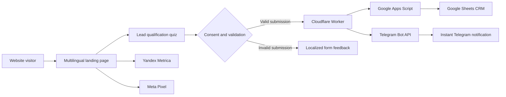

# Performance Marketing Landing Page

A multilingual landing page for performance marketer **Zarema Serikova**. The project is more than a static presentation website: it includes an interactive lead-qualification quiz, analytics, a serverless lead-processing pipeline, a lightweight CRM in Google Sheets, and instant Telegram notifications.

[View the live website](https://zarema-performance.jumanur62.chatgpt.site)


## About the project

The website presents a performance marketing service and guides potential clients through a focused conversion funnel. Visitors can learn about the service, complete a multi-step quiz, provide their contact details, and submit a qualified request.

Before a request can be sent, the visitor must confirm consent to personal data processing. The consent text links to the project's [Privacy Policy](./public/privacy-policy.pdf). The interface validates the form and displays clear success or error feedback.

The project was designed and developed as an end-to-end system: from the public user interface to analytics, lead delivery, and follow-up workflow.

## Key features

- Responsive layout for desktop, tablet, and mobile devices
- Russian, Kazakh, and English versions with locale-specific metadata
- Interactive multi-step quiz with progress indication
- Quiz draft recovery through browser session storage
- Required personal data processing consent before submission
- Name and phone number validation with loading, success, and error states
- Collection of quiz answers and `utm_source`, `utm_medium`, `utm_campaign`, `utm_content`, and `utm_term` parameters
- Yandex Metrica integration with Webvisor, click map, link tracking, and bounce analytics
- Meta Pixel integration for `PageView` and `Lead` events
- Lead tracking for quiz submissions and phone, WhatsApp, Telegram, and Instagram contact clicks
- Automated delivery of every successful lead to Google Sheets and Telegram
- SEO metadata, canonical URLs, language alternatives, and social sharing preview
- Accessible navigation, localized labels, and keyboard-friendly quiz dialog

## How it works



The frontend generates a unique lead ID and sends the contact information, quiz answers, selected language, timestamp, and UTM parameters to a dedicated Cloudflare Worker. The Worker validates the request and delivers it to Google Sheets and Telegram in parallel. The submission is considered successful only when both destinations confirm delivery.

## Google Sheets CRM

Google Sheets is used as a lightweight custom CRM instead of a traditional CRM platform. A Google Apps Script webhook prepares the sheet and stores each lead with:

- submission time and unique lead ID;
- current lead status;
- visitor name and phone number;
- selected website language;
- all quiz questions and answers;
- advertising source and UTM parameters.

The sheet includes formatted headers, filters, configured column widths, a frozen header row, and a controlled list of lead statuses such as new request, contacted, qualified, meeting scheduled, contract, successful, and rejected. Duplicate submissions with the same lead ID do not create additional rows.

## Technology stack

| Area | Technologies |
| --- | --- |
| Frontend | React 19, Next.js 16, TypeScript |
| Build and runtime | Vite, vinext |
| Hosting | Cloudflare Sites |
| Serverless backend | Cloudflare Workers |
| Lead storage and CRM | Google Sheets, Google Apps Script |
| Notifications | Telegram Bot API |
| Analytics | Yandex Metrica, Meta Pixel |
| Styling | CSS, Tailwind CSS toolchain |
| Testing | Node.js test runner, production build checks |

## Getting started

### Requirements

- Node.js 22.13.0 or newer
- npm

### Installation

```bash
git clone <repository-url>
cd <project-directory>
npm install
```

### Local development

```bash
npm run dev
```

Open the local URL printed by Vite. The root route redirects to the Russian version; `/kz` and `/en` open the Kazakh and English versions.

### Production build

```bash
npm run build
npm start
```

### Tests and linting

```bash
npm test
npm run lint
```

`npm test` creates a production build and verifies routing, localization, metadata, contact tracking, local media, privacy-policy access, and core quiz behavior.

## Lead Worker configuration

The lead-processing backend is located in `lead-worker/`. To connect your own Google Sheet and Telegram bot, configure the following Cloudflare Worker secrets:

- `GOOGLE_SHEETS_WEBHOOK_URL`
- `GOOGLE_SHEETS_WEBHOOK_SECRET`
- `TELEGRAM_BOT_TOKEN`
- `TELEGRAM_CHAT_ID`

Add them with Wrangler without storing their values in the repository:

```bash
npx wrangler secret put GOOGLE_SHEETS_WEBHOOK_URL --config lead-worker/wrangler.jsonc
npx wrangler secret put GOOGLE_SHEETS_WEBHOOK_SECRET --config lead-worker/wrangler.jsonc
npx wrangler secret put TELEGRAM_BOT_TOKEN --config lead-worker/wrangler.jsonc
npx wrangler secret put TELEGRAM_CHAT_ID --config lead-worker/wrangler.jsonc
```

Validate and deploy the Worker:

```bash
npx tsc --project lead-worker/tsconfig.json
npx wrangler deploy --config lead-worker/wrangler.jsonc --dry-run
npx wrangler deploy --config lead-worker/wrangler.jsonc
```

The Google Apps Script webhook source is available at `lead-worker/google-apps-script/Code.gs`. Its script properties must contain `SPREADSHEET_ID`, `SHEET_NAME`, and the same webhook secret used by the Worker.

## Project structure

```text
app/                              Landing page, localization, quiz, and analytics
public/                           Images, social preview, and privacy policy
lead-worker/src/index.ts          Cloudflare Worker for lead processing
lead-worker/google-apps-script/   Google Sheets webhook and CRM automation
tests/                            Rendered HTML and behavior checks
worker/                           Cloudflare entry point for the frontend
.openai/hosting.json              Sites project configuration
```

## Security and reliability

- The quiz cannot be submitted until the visitor confirms consent and the required fields pass validation.
- The Worker accepts JSON `POST` requests only from explicitly allowed origins.
- Incoming values are normalized and length-limited before delivery.
- Request and external-response sizes are limited.
- Google Sheets and Telegram requests use timeouts and explicit success checks.
- Both delivery operations are logged, and partial delivery is reported as an error to the frontend.
- Unique lead IDs and Apps Script locking prevent duplicate CRM rows.
- Spreadsheet values are escaped to reduce formula-injection risk.
- API tokens and webhook credentials are stored as Cloudflare secrets and are excluded from Git.

> The included consent flow and privacy policy support transparent data collection, but legal requirements depend on the jurisdiction and deployment context.

## What I learned

This project gave me practical experience in building a complete product rather than an isolated web page. I worked with responsive and accessible frontend development, multilingual content, form state management, server-side validation, serverless architecture, analytics events, UTM attribution, external APIs, data automation, secrets management, and deployment on Cloudflare.

It also helped me understand how technical decisions connect to business goals: qualifying leads before they reach a manager, reducing response time through Telegram notifications, and keeping acquisition data organized in a simple CRM workflow.

## Current status

The project is deployed and operational. The production build succeeds, and the automated test suite contains seven passing tests.

---

Built as a personal portfolio project demonstrating frontend development, marketing analytics, and serverless automation.
